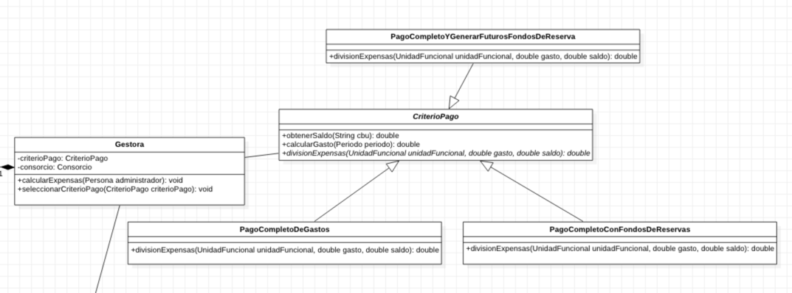
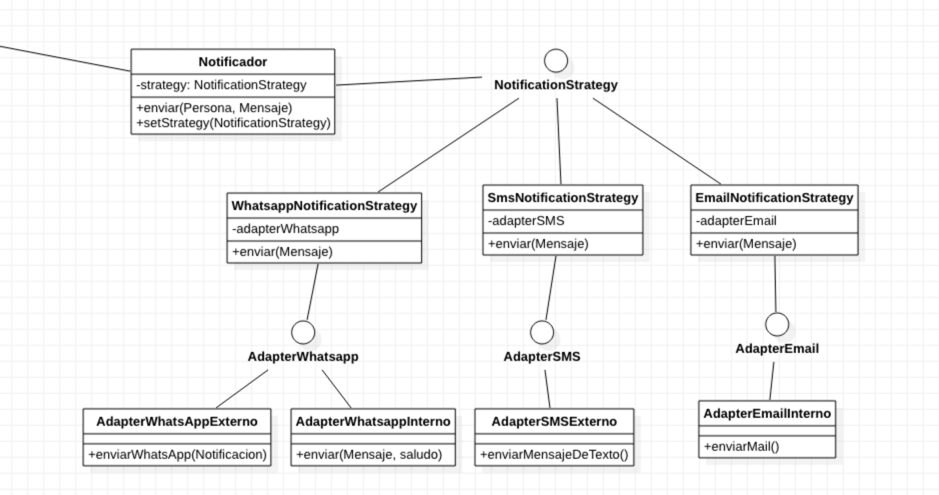
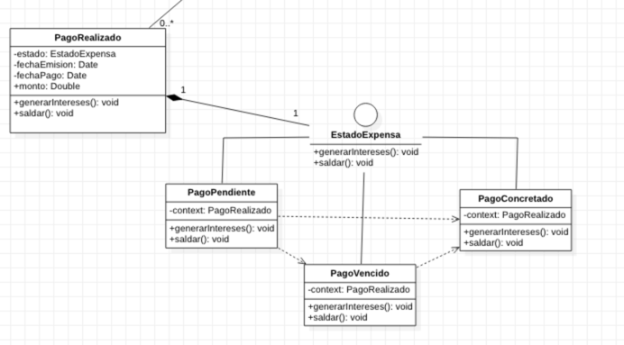

# ADO-2022
## v0.0.3
- Agregamos la gestora
- Agregamos criterios de pago
  

## v0.0.2
- Agrega el notificador
- Agregamos estrategias
- Agregamos adapters de las estrategias

## v0.02.2
- Agrega el notificador
- Agregamos estrategias
- Agregamos adapters de las estrategias

## v0.0.4
- Agregamos PagoRealizado
- Agregamos estados de pagos y comportamiento

## v0.0.3
- Agregamos la gestora
- Agregamos criterios de pago

## v0.0.2
- Agrega el notificador
- Agregamos estrategias
- Agregamos adapters de las estrategias

## v0.0.4
- Agregamos PagoRealizado
- Agregamos estados de pagos y comportamiento

## v0.0.3
- Agregamos la gestora
- Agregamos criterios de pago

## v0.0.2
- Agrega el notificador
- Agregamos estrategias
- Agregamos adapters de las estrategias

## v0.0.1
Iniciamos la construcción de algunas clases:
- Gasto
  - Gasto recurrente
  - Gasto único
  - Tipo de expensa
  - TipoGasto
- Consorcion
- CuentaBancaria
- Periodo
- UnidadFuncional
